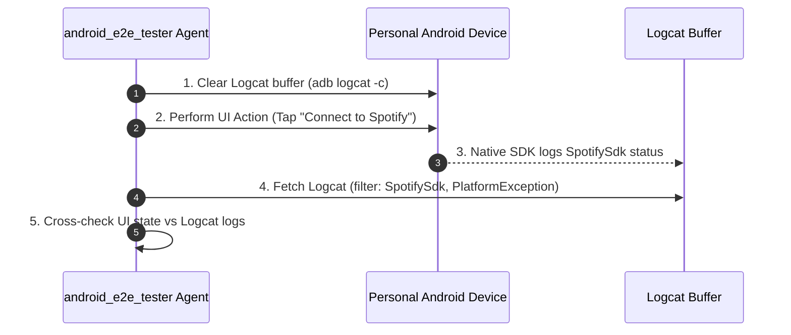

# Android End-to-End (E2E) Testing Guide with ADB MCP

Autonomous end-to-end testing of `spotify_sdk` example app on physical Android devices via ADB MCP servers and real-time Logcat verification.

---

## 1. ADB MCP Server Capabilities

| Server | Primary Focus | Best For |
| :--- | :--- | :--- |
| **`mobile-next/mobile-mcp`** | UI gesture automation & accessibility tree | UI testing (taps, swipes, SSO flows) |
| **`landicefu/android-adb-mcp-server`** | ADB CLI wrapper & Logcat diagnostics | Logcat cross-checking & shell commands |

Workspace configuration lives in [.mcp.json](file:///Users/tobi/Projects/spotify_sdk/.mcp.json).

---

## 2. Device Prerequisites

1. USB Debugging enabled on physical Android device (`adb devices`).
2. Spotify Premium app installed and logged in.
3. Credentials defined in [packages/spotify_sdk/example/.env](file:///Users/tobi/Projects/spotify_sdk/packages/spotify_sdk/example/.env) (`CLIENT_ID`, `REDIRECT_URL`).

---

## 3. Logcat Cross-Checking Workflow

### Verification Steps:
1. **Clear Logcat**: Reset log buffer before test execution (`adb logcat -c`).
2. **Execute Action**: Trigger UI interaction (Connect, Play, Pause, Skip).
3. **Dual Verification**:
   - **UI State**: Confirm UI widget update (e.g. "Player state: Playing").
   - **Logcat**: Filter logcat by `SpotifySdk` or `PlatformException` tags.
4. **Root Cause Isolation**: Parse native stack trace on failures to identify missing authorization scopes, unreachable Spotify service, or serialization errors.

